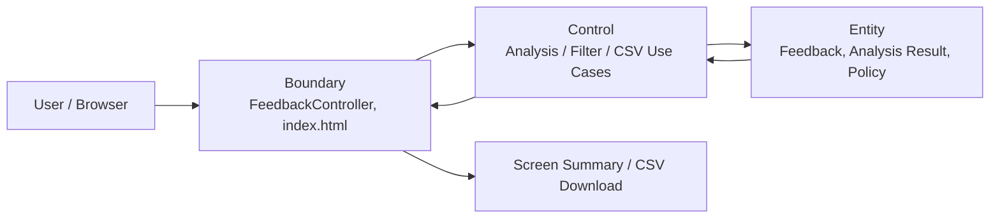

# DemoApplication.java

고객 피드백을 입력하는 학습자가 수동 입력 또는 CSV 입력으로 피드백을 제공하면, 시스템은 감정과 키워드 기준으로 분석하고 시각화 및 CSV 다운로드 결과를 제공한다.


## 목차

- [개요 (Overview)](#개요-overview)
- [빠른 시작 (Quick Start)](#빠른-시작-quick-start)
- [입력 형식 계약](#입력-형식-계약)
- [아키텍처](#아키텍처)
- [테스트 실행](#테스트-실행)
- [출력 포맷](#출력-포맷)
- [생성형 AI 활용 Activities (6시간)](#생성형-ai-활용-activities-6시간)
- [기여 가이드](#기여-가이드)
- [라이선스](#라이선스)

## 개요 (Overview)

Feedback Analyzer는 고객 피드백을 수동 입력 또는 CSV로 받아 감정(`긍정`, `부정`, `중립`)과 키워드 카테고리(`배송`, `품질`, `가격`, `서비스`, `사용성`) 기준으로 분석하는 Spring Boot + Thymeleaf 학습용 웹 애플리케이션입니다.

### 이 프로젝트가 해결하는 문제

현재 피드백 분석 흐름은 입력, 분석, 필터링, 출력 책임이 한 흐름에 강하게 결합되어 있습니다. 그 결과 빈 입력, CSV 형식 오류, 알 수 없는 값 입력의 처리 기준을 테스트로 고정하기 어렵고, 키워드나 감정 규칙 변경 시 기존 결과가 깨지는 회귀를 빠르게 찾기 어렵습니다.

### 주요 학습 목표

| 목표 | 설명 |
| --- | --- |
| OCP | 새 감정 키워드, 키워드 카테고리, 분석 단위를 추가해도 기존 공개 계약을 변경하지 않는 구조를 지향합니다. |
| SRP | 입력 검증, 분석, 필터링, 출력 책임을 각각 독립적으로 검증 가능한 단위로 분리합니다. |
| BCE | Boundary, Control, Entity 관점으로 웹 입력/출력, 흐름 제어, 도메인 데이터를 분리합니다. |
| TDD | 결함 수정 전 실패 테스트를 먼저 추가하고, 입력/출력 계약을 회귀 테스트로 보호합니다. |

### 현재 코드의 문제점과 개선 방향

| 현재 문제 | 개선 방향 |
| --- | --- |
| `FeedbackController`가 입력 검증, CSV 처리, 분석 호출, 필터링, 다운로드를 모두 담당합니다. | Boundary는 요청/응답 계약에 집중하고 Control 서비스가 유스케이스 흐름을 조정하도록 분리합니다. |
| `Session`과 컨트롤러 필드가 애플리케이션 전역 상태처럼 동작합니다. | 사용자별 상태 저장 정책을 명확히 하고 테스트 간 상태를 격리합니다. |
| `TextAnalyzer`, `Filters`, `UIComponents`가 분석 기준을 중복 관리합니다. | 감정/키워드 정책을 단일 등록 지점으로 모아 OCP 확장을 쉽게 만듭니다. |
| CSV 업로드/다운로드의 형식 검증과 이스케이프 정책이 약합니다. | `text` 헤더, 빈 값, UTF-8, CSV escaping 계약을 테스트로 고정합니다. |
| 테스트가 Spring Context 로드에 치우쳐 있습니다. | 입력 검증, 감정 분석, 키워드 분류, 필터링, CSV 다운로드 계약 테스트를 추가합니다. |

## 빠른 시작 (Quick Start)

### 사전 조건

| 항목 | 권장 값 |
| --- | --- |
| Java | 현재 `pom.xml` 기준 Java 17 이상 |
| 빌드 도구 | Maven |
| 프레임워크 | Spring Boot 3.5.x, Thymeleaf |

> PRD의 기술 스택 목표에는 Java 21이 포함되어 있습니다. 현재 저장소의 빌드 설정은 Java 17입니다.

### 클론

```bash
git clone https://github.com/jh8710/feedback_analyzer_A02.git
cd feedback_analyzer_A02
```

### 빌드 & 실행

```bash
mvn spring-boot:run
```

브라우저에서 다음 주소로 접속합니다.

```text
http://localhost:8080
```

### 예시 입출력

```text
입력:
복숭아 좋다

현재 구현 기준 결과:
- 피드백 목록에 "복숭아 좋다" 저장
- 감정 분석: 중립 1건
- 키워드 분석: 배송 0, 품질 0, 가격 0, 서비스 0, 사용성 0

PRD 계약 예시:
- "복숭아 최고"는 "최고" 키워드 때문에 긍정 1건으로 집계
- "복숭아"는 키워드 카테고리 비대상 단어이므로 키워드 카운트 증가 없음
```

## 입력 형식 계약

### 정상 입력

수동 입력은 비어 있지 않은 피드백 텍스트여야 합니다. CSV 입력은 첫 행에 `text` 헤더를 포함해야 하며, 각 행의 `text` 값이 피드백 본문으로 처리됩니다.

| 입력 예시 | 포함 요소 | 기대 결과 |
| --- | --- | --- |
| `배송이 빠르고 좋아요` | 배송 키워드, 긍정 감정 | 감정 `긍정`, 키워드 `배송` 카운트 증가 |
| `가격이 비싸서 불만입니다` | 가격 키워드, 부정 감정 | 감정 `부정`, 키워드 `가격` 카운트 증가 |
| `사용법은 어렵지만 상담은 친절했습니다` | 사용성/서비스 키워드, 긍정/부정 단서 | 감정/키워드 규칙에 따라 분석 결과 집계 |

CSV 입력 예시는 다음과 같습니다.

```csv
text
배송이 빠르고 좋아요
가격이 비싸서 불만입니다
사용법은 어렵지만 상담은 친절했습니다
```

### 비정상 입력

| 케이스 | 입력 예시 | PRD 기준 에러 메시지 | 기대 동작 |
| --- | --- | --- | --- |
| 특수문자만 있음 | `!!!@@@###` | `입력 내용이 필요합니다` | 분석 대상에 추가하지 않고 기존 분석 결과 유지 |
| 내용 `null` | `null` | `입력 내용이 필요합니다` | 분석 대상에 추가하지 않고 기존 분석 결과 유지 |

> 현재 구현은 일부 비정상 입력을 명시적 오류로 구분하지 않을 수 있습니다. 이 표는 Phase 5 PRD 기준으로 고정해야 할 입력 계약입니다.

## 아키텍처

### BCE 레이어 다이어그램



### 현재 클래스 배치

| BCE | 현재 클래스 | 책임 |
| --- | --- | --- |
| Boundary | `FeedbackController`, `index.html` | HTTP 요청, 화면 모델, CSV 다운로드 응답 |
| Control | `TextAnalyzer`, `Filters`, `FileHandler`, `UIComponents` | 분석, 필터링, 출력 보조, 화면 옵션 제공 |
| Entity | `Feedback`, `Constants` | 피드백 데이터, 감정/키워드 정책 데이터 |

### 의존성 방향

```text
Boundary -> Control -> Entity
```

Boundary는 사용자의 입력과 출력 계약을 담당합니다. Control은 분석, 필터링, CSV 처리 같은 유스케이스 흐름을 조정합니다. Entity는 피드백 데이터와 분석 정책의 의미를 보존합니다. 분석 규칙은 화면 표현 방식에 의존하지 않아야 하며, 새 규칙 추가가 컨트롤러 변경으로 번지지 않는 방향을 지향합니다.

### 새 단위 추가 방법

코드 구현을 추가하지 않는 Phase 5 기준에서는 아래 절차를 문서와 테스트 계약으로 먼저 고정합니다.

1. 새 분석 단위가 감정, 키워드, 필터, 출력 중 어느 계약에 영향을 주는지 정의합니다.
2. 입력 예시와 기대 출력 예시를 PRD 또는 Gherkin Scenario에 추가합니다.
3. 기존 공개 계약(`text` CSV 헤더, 감정 값, 키워드 카테고리, CSV 출력)을 변경하지 않는지 확인합니다.
4. 실패하는 단위 테스트 또는 계약 테스트를 먼저 추가할 수 있도록 테스트 케이스를 작성합니다.
5. 구현 단계에서는 기존 분석 정책 등록 지점에만 최소 변경을 적용하고, Boundary 변경을 피합니다.

## 테스트 실행

```bash
mvn test
```

Gradle을 사용하는 분기라면 다음 명령을 사용합니다.

```bash
gradle test
```

PRD 기준 테스트 목표는 다음과 같습니다.

| 영역 | 목표 |
| --- | --- |
| Domain | 핵심 도메인 로직 라인 커버리지 80% 이상 |
| Boundary | 수동 입력, CSV 입력, 필터링, 다운로드 계약 테스트 100% 통과 |
| Data | `text` 필수 컬럼, UTF-8 CSV 다운로드, 한글 피드백 보존 100% 검증 |
| Branch | 입력 검증, 분류, 감정 분석 주요 분기 커버리지 90% 이상 |

## 출력 포맷

### 콘솔 출력 예시

```text
[INFO] 피드백 분석기 시작
[INFO] 복숭아 좋다
[INFO] 현재 1개의 피드백이 입력되었습니다.
[INFO] 감성 분석 완료
[INFO] 키워드 분석 완료
```

### 화면 분석 결과 예시

```text
감정 분석
- 긍정: 0
- 중립: 1
- 부정: 0

키워드 분석
- 배송: 0
- 품질: 0
- 가격: 0
- 서비스: 0
- 사용성: 0
```

### CSV 다운로드 예시

CSV 다운로드는 UTF-8 인코딩과 첫 행 `text` 헤더를 기준 계약으로 사용합니다.

```csv
text
복숭아 좋다
배송이 빠르고 좋아요
가격이 비싸서 불만입니다
```

## 생성형 AI 활용 Activities (6시간)

README의 Activities는 Phase 5 PRD 산출물 흐름을 기준으로 다음 6시간 활동으로 정리합니다.

| 시간 | Activity | 산출물 |
| --- | --- | --- |
| 1시간 | 프로젝트 개요와 실행 흐름 파악 | 주요 기능, 기술 스택, 실행 방법 정리 |
| 1시간 | 문제 정의와 사용자 관점 정리 | 입력 계약, 오류 정책, 학습자 Pain Point 도출 |
| 1시간 | BCE, 계약, RED 테스트 관점 분석 | Boundary/Control/Entity 책임과 실패 테스트 후보 정리 |
| 1시간 | OCP/SRP 리팩토링 방향 정리 | 분석 정책 중복, 컨트롤러 책임 집중, 상태 관리 문제 정리 |
| 1시간 | Epic, Journey, Story, Gherkin, 체크리스트 정리 | 인수 기준과 회귀 보호 규칙 도출 |
| 1시간 | PRD 문서화 및 README 반영 | `docs/PRD.md` 기준 README, 입력/출력/테스트 계약 정리 |

## 기여 가이드

1. 공개 입력 계약을 변경할 때는 PRD, Story Acceptance Criteria, Gherkin Scenario를 먼저 갱신합니다.
2. 버그 수정 전에는 실패를 재현하는 테스트를 먼저 추가합니다.
3. 감정 값(`긍정`, `부정`, `중립`)과 키워드 카테고리(`배송`, `품질`, `가격`, `서비스`, `사용성`)의 공개 의미를 임의로 바꾸지 않습니다.
4. CSV 입력은 `text` 헤더, CSV 출력은 UTF-8과 `text` 헤더를 유지합니다.
5. 코드 변경 시 빌드 산출물(`target/`)은 커밋 대상에서 제외합니다.

## 라이선스

MIT License
